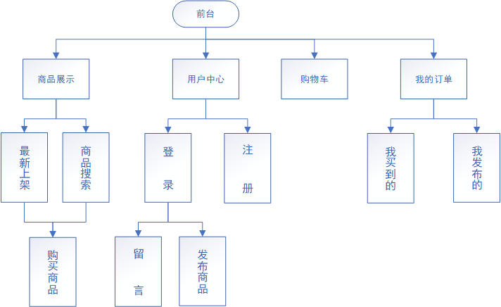
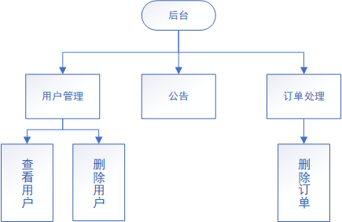

# README

#### 一、项目名称

​		咸鱼

​        aidxy.cn

#### 二、项目描述

​		咸鱼交易平台旨在为用户提供一个转卖闲置物品交易的平台，系统主要功能模块为用户模块，订单模块，购物车，查询模块，留言模块--------等。

​		在网站设计中，分为前台和后台两个部分设计，前台主要功能有：注册，登录，用户中心，发布闲置信息，查询供求信息，用户留言等功能，后台主要功能有：用户管理，订单管理，公告等。

#### 三、环境以及架构

​		1).操作系统：Linux/windows

​		2).Python版本：Python3.6

​		3).数据库：MySQL/redis 

​		4).开发工具：PyCharm

​		5)Python Web 框架：Django / bootstrap

#### 四、项目选型介绍

​		本项目前端使用bootstrap , 后端使用Django框架进行数据交互.

#### 五、主体设计

1. 前台结构图：

   

2. 后台结构图：

#### 六、人员与分工

组名:	TODO

组长：谢捷(打杂统筹)

组员：

​		陈进杰：商品展示，留言咨询

​		李响翔：订单发布，订单信息管理

​		陈伟明：用户登录，用户注册，购买支付

​		刘玉阳：用户中心

​		黄登：购物车

可供扩展：直播带货、智能推荐

#### 七、功能描述

>1. 首页：展示最新上架商品，可搜索关键字商品。
>2. 用户：登录，注册，用户中心修改个人信息
>3. 订单：发布商品，查看，修改发布信息，查看购买信息
>4. 留言咨询：留言查看及回复
>5. 购物车：收藏心仪商品
>6. 后台：超级管理员

